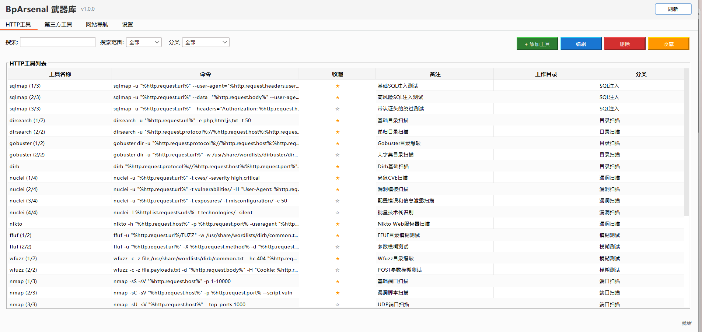
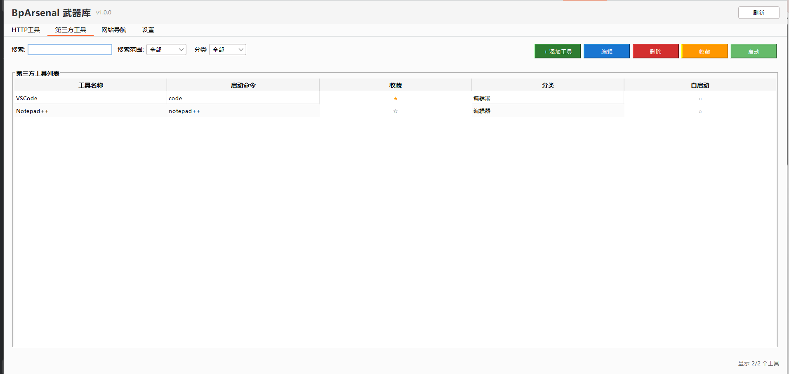
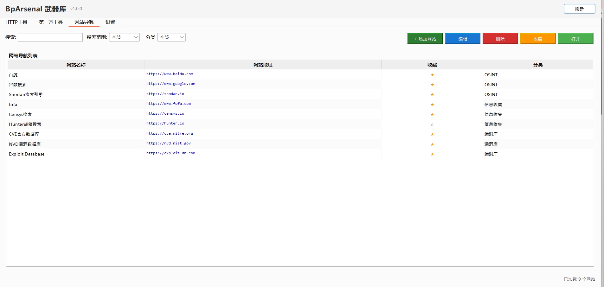
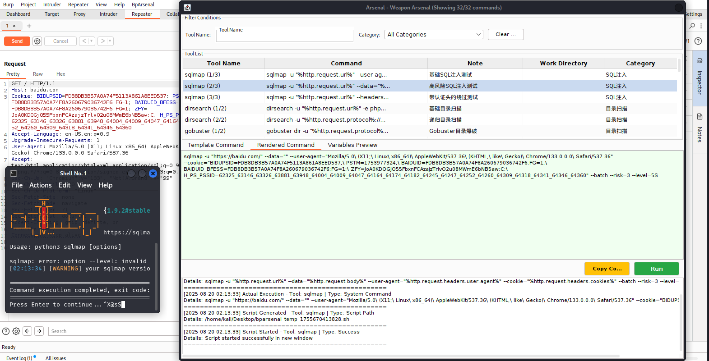

# BpArsenal - Burp Suite Arsenal Plugin


**[中文](README_CN.md) | English**


BpArsenal is a Burp Suite plugin developed based on the Montoya API, designed to quickly convert HTTP requests into command-line tool executions, launch third-party tools, and open related websites to improve penetration testing efficiency.

| Interface Name   | Interface Display                               |
| ---------------- |-------------------------------------------------|
| http tool        |             |
| third-party tool |                                                  |
| website          |             |
| setting          |             |
| shell\_exec      |           |


## 🚀 Key Features

### 1. HTTP Tool Integration

- **One-Click Conversion**: Quickly convert HTTP requests from Burp Suite into command lines for various security tools
- **Variable Replacement**: Support dynamic variable replacement, automatically extracting URLs, parameters, headers, and other information from requests
- **Batch Processing**: Support processing multiple requests simultaneously, generating batch commands
- **Working Directory**: Support configuring independent working directories for each tool

### 2. Third-Party Tool Management

- **Quick Launch**: One-click launch of commonly used penetration testing tools
- **Auto Start**: Support automatic startup of specified tools when the plugin loads
- **Favorite Management**: Mark frequently used tools as favorites for quick access

### 3. Website Bookmarks

- **Quick Access**: Bookmark commonly used security-related websites and tools
- **Category Management**: Organize website links by function categories
- **One-Click Open**: Quickly open websites in the default browser

### 4. Settings Management

- **Tool Directory**: Configure global tool root directory to simplify path management
- **Command Prefix**: Customize command execution prefix to adapt to different operating systems
- **Multi-language**: Support Chinese and English interfaces
- **Configuration Import/Export**: Support backup and sharing of configuration files

## 📦 Installation

1. Download the latest JAR file
2. In Burp Suite, go to "Extensions" -> "Installed"
3. Click "Add" -> "Java" -> Select the JAR file
4. After the plugin loads successfully, the "BpArsenal" tab will appear in Burp Suite

## 🤖 Smart Config Generator

We provide a smart configuration generator `generator_config.py` that can automatically scan tool directories and generate configuration files.

### Quick Start

```bash
# 1. View tool directory structure
python script/generator_config.py tree --dir /path/to/tools

# 2. Generate AI prompt (manually send to ChatGPT, etc.)
python script/generator_config.py prompt --dir /path/to/tools --type all --output prompt.txt

# 3. Or directly call AI to generate config (requires OpenAI API key)
python script/generator_config.py generate \
  --dir /path/to/tools \
  --api-key sk-xxx \
  --model gpt-4 \
  --type all \
  --output config.yaml
```

**Detailed Usage**: See [script/README.md](script/README.md)

---

## 🛠️ Configuration Guide

### config.yaml Configuration File Structure

The plugin's core configuration file is `src/main/resources/config.yaml`, containing three main sections:

#### 1. HTTP Tool Configuration (httpTool)

HTTP tools support converting requests from Burp Suite into command-line tool executions with powerful DSL expressions:

```yaml
httpTool:
- type: Tool Category Name
  content:
  - toolName: Tool Name
    commandList:
    - command: Command Template with DSL Variables
      favor: true/false
      note: Command Description
      workDir: Working Directory Path
```

**Field Descriptions:**

- `type`: Tool category, such as "SQL Injection", "Directory Scanning", etc.
- `toolName`: Specific tool name, such as "sqlmap", "ffuf", etc.
- `command`: Command template supporting DSL variable replacement and function calls
- `favor`: Whether it's a favorite command
- `note`: Detailed description of the command
- `workDir`: Working directory for command execution (optional)

**DSL Variable Syntax:**

All DSL expressions use `%expression%` format:
- **Chain Access**: `%http.request.url%`
- **Function Call**: `%hash(http.request.body, "sha256")%`
- **Nested Expression**: `%base64(json(http.request.body, "$.token"), "encode")%`

**Basic HTTP Variables:**

| Variable Name                                  | Description           | Example                           |
| ---------------------------------------------- | --------------------- | --------------------------------- |
| `%http.request.url%`                         | Complete request URL  | `https://example.com/api/login` |
| `%http.request.protocol%`                    | Protocol              | `https`                         |
| `%http.request.host%`                        | Host name             | `example.com`                   |
| `%http.request.port%`                        | Port number           | `443`                           |
| `%http.request.path%`                        | Path                  | `/api/login`                    |
| `%http.request.method%`                      | HTTP method           | `POST`                          |
| `%http.request.query%`                       | Query string          | `id=123&type=user`              |
| `%http.request.body.raw%`                    | Raw request body      | `{"user":"admin"}`              |
| `%http.request.body.length%`                 | Body length           | `256`                           |
| `%http.request.body.type%`                   | Body content type     | `json`                          |
| `%http.request.headers.user.agent%`          | User-Agent header     | `Mozilla/5.0...`                |
| `%http.request.headers.cookie%`              | Cookie header         | `session=abc123`                |
| `%http.request.headers.authorization%`       | Authorization header  | `Bearer token123`               |
| `%http.request.headers.content.type%`        | Content-Type header   | `application/json`              |
| `%http.request.cookies.sessionid%`           | Specific cookie value | `abc123xyz`                     |
| `%http.request.params.url.id%`               | URL parameter         | `123`                           |
| `%http.request.params.body.username%`        | Body parameter        | `admin`                         |
| `%http.response.status%`                     | Response status code  | `200`                           |
| `%http.response.body.raw%`                   | Response body content | `{"status":"ok"}`               |

**Batch Processing Variables:**

| Variable Name                             | Description                        |
| ----------------------------------------- | ---------------------------------- |
| `%httpList.count%`                      | Number of requests                 |
| `%httpList.urls%`                       | List of all URLs                   |
| `%httpList.hosts%`                      | List of all hosts                  |
| `%httpList.requests[0].request.url%`    | First request URL (indexed)        |
| `%httpList.requests.first.request.url%` | First request URL (semantic)       |
| `%httpList.requests.last.request.host%` | Last request host                  |
| `%httpList.requests.*.request.url%`     | All request URLs (wildcard)        |
| `%httpList.requests.*.request.host%`    | All request hosts (wildcard)       |

**Built-in DSL Functions:**

| Function                              | Description                    | Example                                                  |
| ------------------------------------- | ------------------------------ | -------------------------------------------------------- |
| `hash(data, algorithm)`             | Calculate hash                 | `%hash(http.request.body, "sha256")%`                  |
| `base64(data, mode)`                | Base64 encode/decode           | `%base64(http.request.body, "encode")%`                |
| `json(jsonString, path)`            | Extract JSON value             | `%json(http.response.body, "$.data.token")%`           |
| `regex(text, pattern, group)`       | Regex extraction               | `%regex(http.response.body, "token=([^&]+)", 1)%`      |
| `urlencode(data)`                   | URL encode                     | `%urlencode(http.request.path)%`                       |
| `urldecode(data)`                   | URL decode                     | `%urldecode(http.request.query)%`                      |
| `join(list, delimiter)`             | Join list elements             | `%join(httpList.hosts, ", ")%`                         |
| `unique(list)`                      | Remove duplicates              | `%unique(httpList.hosts)%`                             |
| `count(list)`                       | Count elements                 | `%count(httpList.requests)%`                           |
| `split(input, delimiter)`           | Split string                   | `%split(http.request.url, "/")[2]%`                    |
| `tmpFile(content, extension)`       | Create temp file               | `%tmpFile(http.request.body.raw, 'txt')%`              |
| `file(content, filepath)`           | Create persistent file         | `%file(httpList.hosts, 'hosts.txt')%`                  |

**Advanced DSL Examples:**

```bash
# SQLMap with temp file
sqlmap -r %tmpFile(http.request.body.raw, 'txt')% --batch

# Batch URL scanning
nuclei -list %tmpFile(unique(httpList.requests.*.request.url), 'txt')% -t cves/

# Extract and hash JSON field
echo %hash(json(http.request.body, "$.password"), "sha256")%

# Save unique hosts to file
nmap -iL %file(unique(httpList.requests.*.request.host), 'hosts.txt')% -p 80,443

# Nested functions
curl -H "Auth: %base64(json(http.response.body, "$.token"), "encode")%" https://api.example.com
```

**Configuration Example:**

```yaml
httpTool:
- type: SQL Injection
  content:
  - toolName: sqlmap
    commandList:
    - command: sqlmap -u "%http.request.url%" --cookie="%http.request.headers.cookie%" --batch --dbs
      favor: true
      note: Basic SQL injection test
      workDir: ''
    - command: sqlmap -r %tmpFile(http.request.body.raw, 'txt')% --batch --risk=3 --level=5
      favor: true
      note: Deep injection test with request file
      workDir: ''
    - command: sqlmap -m %tmpFile(unique(httpList.requests.*.request.url), 'txt')% --batch --threads=5
      favor: false
      note: Batch URL injection test
      workDir: ''
```

#### 2. Third-Party Tool Configuration (thirtyPart)

Third-party tools are used to quickly launch commonly used penetration testing tools:

```yaml
thirtyPart:
- type: Tool Category
  content:
  - toolName: Tool Display Name
    startCommand: Launch Command
    favor: true/false
    note: Tool Description
    workDir: Working Directory
    autoStart: true/false
```

**Field Descriptions:**

- `toolName`: Tool display name
- `startCommand`: Tool launch command (full path or system command)
- `favor`: Whether it's a favorite tool
- `note`: Tool description
- `workDir`: Working directory (optional)
- `autoStart`: Whether to auto-start when plugin loads

**Configuration Example:**

```yaml
thirtyPart:
- type: Penetration Framework
  content:
  - toolName: Metasploit
    startCommand: msfconsole
    favor: true
    note: Powerful penetration testing framework
    workDir: ''
    autoStart: false
  - toolName: Burp Suite
    startCommand: burpsuite
    favor: true
    note: Web application security testing
    workDir: ''
    autoStart: false
```

#### 3. Website Bookmark Configuration (webSite)

Website bookmarks are used to quickly access commonly used security-related websites:

```yaml
webSite:
- type: Website Category
  content:
  - url: Website URL
    desc: Website Description
    favor: true/false
```

**Field Descriptions:**

- `type`: Website category, such as "OSINT", "Vulnerability Database", etc.
- `url`: Complete website URL
- `desc`: Website description
- `favor`: Whether it's a favorite website

**Configuration Example:**

```yaml
webSite:
- type: OSINT
  content:
  - url: https://www.shodan.io
    desc: Shodan Search Engine
    favor: true
  - url: https://www.zoomeye.org
    desc: ZoomEye Cyberspace Search
    favor: true
- type: Vulnerability Database
  content:
  - url: https://cve.mitre.org
    desc: CVE Official Database
    favor: true
  - url: https://nvd.nist.gov
    desc: NVD Vulnerability Database
    favor: true
```

## 📋 Usage

### 1. Using Context Menu

1. Select a request in Burp Suite's HTTP history, proxy intercept, or repeater
2. Right-click and select "Arsenal" or "Favorite"
3. Choose the tool and command you want to use in the popup dialog
4. Click "Run" to execute the command

### 2. Using Main Interface

#### HTTP Tools Panel

- Browse all configured HTTP tools
- Use search functionality to quickly locate tools
- Double-click tool rows to open edit dialog
- Right-click menu for add, edit, delete operations

#### Third-Party Tools Panel

- View all configured third-party tools
- Click tool names to quickly launch
- Manage tool favorite status

#### Website Panel

- Browse bookmarked websites
- Click website descriptions to open in browser
- Manage website bookmarks and categories

#### Settings Panel

- **Tool Directory Settings**: Configure global tool root directory to simplify path configuration in commands
- **Command Prefix Settings**: Customize command execution prefix (auto-detects system by default)
- **Language Settings**: Choose interface language (Chinese/English)
- **Configuration Management**: Import, export, reset configuration files

### 3. Working Directory Priority

The system determines command execution working directory in the following priority order:

1. **Tool-configured working directory** - `workDir` field in `config.json`
2. **Global tool directory setting** - Tool root directory configured in settings panel
3. **Current directory** - If none of the above are set, use current working directory

### 4. Variable Replacement Functionality

The plugin automatically replaces variables in command templates with actual HTTP request data:

**Original Command Template:**

```bash
sqlmap -u "%http.request.url%" --cookie="%http.request.headers.cookies%" --dbs
```

**Replaced Command:**

```bash
sqlmap -u "https://example.com/login" --cookie="sessionid=abc123; csrftoken=xyz789" --dbs
```

## 🎯 Best Practices

### 1. Tool Path Configuration

- Use global tool directory settings to avoid writing full paths for each command
- Set separate `workDir` for tools requiring specific environments
- Use relative paths to improve configuration portability

### 2. Command Template Design

- Design multiple command templates for different scenarios
- Use meaningful `note` fields to explain command purposes
- Use `favor` appropriately to mark frequently used commands

### 3. Category Management

- Categorize by tool type or testing phase
- Use consistent naming conventions
- Regularly organize and update configurations

### 4. Security Considerations

- Use high-risk testing commands with caution
- Ensure testing is performed in authorized environments
- Pay attention to sensitive information handling in commands

## 🔧 Technical Architecture

- **Development Language**: Java
- **API Framework**: Burp Suite Montoya API
- **Architecture Pattern**: MVC (Model-View-Controller)
- **Design Patterns**: Singleton Pattern, Strategy Pattern
- **UI Framework**: Java Swing
- **Internationalization**: Multi-language switching support
- **Configuration Format**: JSON

## 📝 Changelog

### v1.0.0

- Initial release
- Support for HTTP tools, third-party tools, website management
- Complete variable replacement system
- Multi-language interface support
- Configuration import/export functionality

## 🤝 Contributing

Issues and Pull Requests are welcome to improve this plugin.

### Development Environment Setup

1. Clone the project: `git clone [repository-url]`
2. Import into IDE (IntelliJ IDEA recommended)
3. Install Maven dependencies
4. Configure Burp Suite development environment

### Commit Guidelines

- `feat`: New features
- `fix`: Bug fixes
- `docs`: Documentation updates
- `style`: Code formatting adjustments
- `refactor`: Code refactoring

## 📄 License

This project is licensed under the MIT License - see the [LICENSE](LICENSE) file for details.

## 👨‍💻 Author

**youmulijiang** 

I'm just an ordinary security developer.If this project helps you, please click the ⭐ in the top-right corner.
youmulijiang loves stars the most! ヾ(≧▽≦*)o*

---

**⚠️ Disclaimer**: This tool is intended for authorized security testing only. Users are responsible for their own actions. The author assumes no liability for any loss or damage caused by misuse, abuse, or illegal use of this tool.
