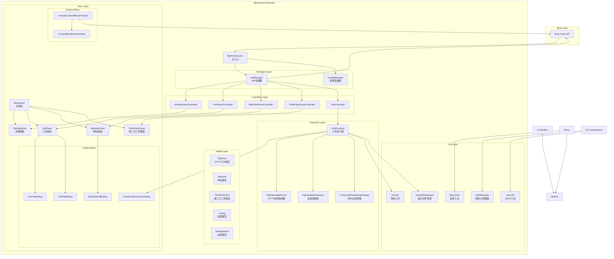

# BpArsenal - Burp Suite 扩展工具集


## 📋 项目简介

BpArsenal 是一个功能强大的 Burp Suite 扩展工具集，旨在提升渗透测试和安全研究的效率。该扩展提供了丰富的HTTP工具、第三方工具集成、网站管理等功能，支持中英文双语界面，采用模块化设计，易于扩展和维护。

## ✨ 主要特性

- 🛠️ **工具管理**: 集成多种HTTP测试工具，支持自定义命令和参数
- 🌐 **网站管理**: 统一管理测试目标网站信息
- 🔧 **第三方工具**: 集成外部安全工具，扩展测试能力
- 🌍 **国际化支持**: 完整的中英文双语界面
- 📋 **上下文菜单**: 右键菜单快速调用工具
- ⚙️ **配置管理**: 灵活的配置系统，支持导入导出
- 🎨 **现代UI**: 基于Swing的现代化用户界面

## 🏗️ 项目架构



## ⚙️ 配置文件说明

插件配置存储在 `src/main/resources/config.json` 中，采用JSON格式，主要包含三部分配置：

### 1. HTTP工具配置

```json
{
  "httpTool": [
    {
      "type": "SQL注入",
      "content": [
        {
          "toolName": "sqlmap",
          "command": [
            "python D:\\tools\\sqlmap\\sqlmap.py -u \"%http.request.url%\" --user-agent=\"%http.request.headers.user-agent%\" --cookie=\"%http.request.headers.cookie%\" --dbs"
          ],
          "favor": true
        }
      ]
    }
  ]
}
```

### 2. 第三方工具配置

```json
{
  "thirtyPart": [
    {
      "type": "exploit",
      "content": [
        {
          "toolName": "burpsuite",
          "startCommand": "java -jar D:\\tools\\burpsuite\\burpsuite_pro.jar",
          "favor": true,
          "autoStart": false
        }
      ]
    }
  ]
}
```

### 3. 网站资源配置

```json
{
  "webSite": [
    {
      "type": "OSINT",
      "content": [
        {
          "url": "https://www.google.com",
          "desc": "谷歌搜索",
          "favor": true
        }
      ]
    }
  ]
}
```

配置字段说明：

- `type`: 工具/资源分类
- `toolName`: 工具名称
- `command`: 工具命令模板（支持变量替换）
- `favor`: 是否标记为常用
- `autoStart`: 是否自动启动
- `url`: 网站地址
- `desc`: 网站描述

## 🚀 主要功能

### 1. HTTP工具管理

- 预置多种常用HTTP测试工具
- 支持自定义工具命令和参数
- 变量替换功能，动态生成命令
- 工具执行结果展示

### 2. 网站信息管理

- 统一管理测试目标网站
- 支持URL、描述、标签等信息
- 快速访问和组织测试目标

### 3. 第三方工具集成

- 集成外部安全测试工具
- 支持命令行工具调用
- 自定义工具配置

### 4. 上下文菜单集成

- 右键菜单快速调用功能
- 与Burp Suite原生功能无缝集成
- 支持多种请求/响应处理

### 5. 配置管理

- JSON格式配置文件
- 支持配置导入导出
- 实时配置保存

### 6. 国际化支持

- 完整的中英文双语界面
- 动态语言切换
- 扩展性国际化框架

## 📦 项目结构

```
src/main/java/
├── BpArsenal.java              # 主入口类
├── controller/                 # 控制器层
│   ├── SettingPanelController.java
│   ├── ToolPanelController.java
│   ├── WebSitePanelController.java
│   ├── ThirdPartyPanelController.java
│   └── ToolController.java
├── manager/                    # 管理器层
│   ├── ApiManager.java         # API管理器
│   └── ConfigManager.java      # 配置管理器
├── model/                      # 数据模型层
│   ├── Config.java
│   ├── HttpTool.java
│   ├── WebSite.java
│   ├── ThirdPartyTool.java
│   └── SettingModel.java
├── view/                       # 视图层
│   ├── MainPanel.java          # 主面板
│   ├── ToolPanel.java          # 工具面板
│   ├── WebsitePanel.java       # 网站面板
│   ├── ThirdPartyPanel.java    # 第三方工具面板
│   ├── SettingPanel.java       # 设置面板
│   ├── component/              # UI组件
│   ├── contextmenu/            # 上下文菜单
│   └── menu/                   # 菜单组件
├── executor/                   # 执行器层
│   ├── ToolExecutor.java       # 工具执行器
│   ├── HttpMessageParser.java  # HTTP消息解析
│   └── HttpVariableReplacer.java # 变量替换
└── util/                       # 工具类
    ├── I18nManager.java        # 国际化管理
    ├── JsonUtil.java           # JSON工具
    ├── OsUtils.java            # 系统工具
    └── TempFileManager.java    # 临时文件管理
```

## 🛠️ 技术栈

- **Java 11+**: 核心开发语言
- **Maven**: 项目构建和依赖管理
- **Burp Suite API**: Burp Suite扩展开发接口
- **Swing**: 用户界面框架
- **Gson**: JSON处理

## 📋 系统要求

- Java 11 或更高版本
- Burp Suite Professional/Community
- Maven 3.6+ (用于构建)

## 🔧 构建和安装

### 构建项目

```bash
# 克隆项目
git clone <repository-url>
cd BpArsenal

# 使用Maven构建
mvn clean compile package

# 生成的JAR文件位于 target/ 目录
```

### 安装到Burp Suite

1. 打开Burp Suite
2. 进入 "Extensions" 选项卡
3. 点击 "Add" 按钮
4. 选择 "Java" 作为扩展类型
5. 选择构建生成的JAR文件
6. 点击 "Next" 完成安装

## 📖 使用指南

### 基本使用

1. **安装扩展后**，在Burp Suite的Extensions选项卡中可以看到BpArsenal扩展
2. **主界面**会显示在Burp Suite的主选项卡中
3. **右键菜单**会在HTTP请求/响应区域提供快速工具调用

### 工具配置

1. 进入设置面板配置基本参数
2. 在工具面板中添加或编辑HTTP工具
3. 在网站面板中管理测试目标
4. 在第三方工具面板中集成外部工具

### 变量系统

支持以下标准变量替换（使用 `%变量%` 格式）：

#### 请求基础变量

- `%http.request.url%`: 完整请求URL
- `%http.request.method%`: HTTP方法 (GET/POST等)
- `%http.request.path%`: 请求路径
- `%http.request.host%`: 目标主机
- `%http.request.port%`: 目标端口

#### 请求头部变量

- `%http.request.headers.user.agent%`: User-Agent头
- `%http.request.headers.cookies%`: Cookie字符串
- `%http.request.headers.content.type%`: 内容类型

#### 请求参数变量

- `%http.request.params.url.{name}%`: URL参数值
- `%http.request.params.body.{name}%`: POST参数值

#### 响应变量

- `%http.response.status%`: 响应状态码
- `%http.response.body%`: 完整响应体

完整变量列表请参考 `PlaceholderDocumentation` 类。

示例用法:

```bash
# 使用curl重放请求
curl -X %http.request.method% "%http.request.url%"

# 根据响应状态处理
if [ "%http.response.status%" = "200" ]; then
    echo "请求成功"
fi
```

## 🤝 贡献指南

欢迎提交Issue和Pull Request来改进项目！

### 开发规范

1. 遵循项目现有的代码风格
2. 所有UI文本必须使用国际化系统
3. 添加适当的单元测试
4. 更新相关文档

### 国际化规范

- 所有用户可见文本都必须通过 `I18nManager`进行国际化
- 在 `messages_zh_CN.properties`和 `messages_en_US.properties`中添加对应的文本
- UI组件必须实现语言切换监听器

## 📝 许可证

本项目采用 MIT 许可证。详情请参见 [LICENSE](LICENSE) 文件。

## 🔗 相关链接

- [Burp Suite](https://portswigger.net/burp)
- [Burp Extender API](https://portswigger.net/burp/extender)
- [项目文档](./doc/)

## 📧 联系方式

如有问题或建议，请通过以下方式联系：

- 提交 [GitHub Issue](../../issues)
- 发送邮件到: [你的邮箱]

---

*BpArsenal - 让渗透测试更高效* 🚀
