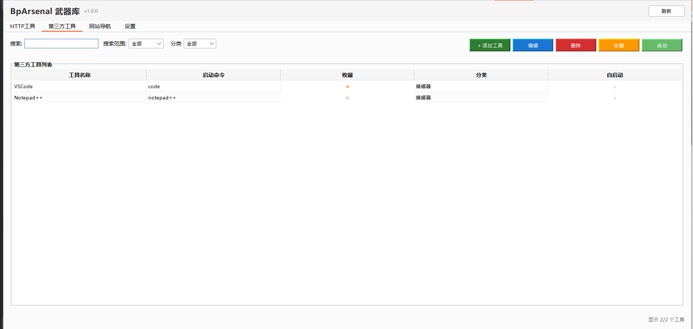
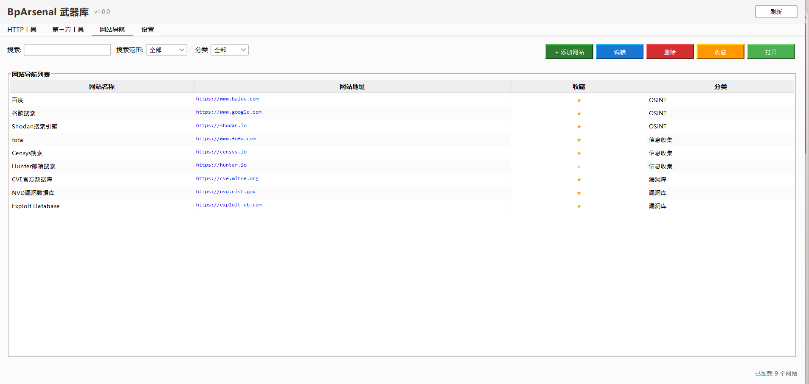

# BpArsenal - Burp Suite 武器库插件


**中文 | [English](README.md)**

BpArsenal 是一个基于 Montoya API 开发的 Burp Suite 插件，旨在快速将 HTTP 请求转化为命令行工具执行、启动第三方工具和打开相关网站，提高渗透测试效率。


| 界面名称                         | 界面展示                                             |
|------------------------------|--------------------------------------------------|
| http tool(报文转化工具界面)          |               |
| thirdy-party tool  (第三方工具界面) |  |
| website (第三方网站面板)            |              |
| setting (设置界面)               |              |               
| shell_exec(执行命令界面)           ||


## 🚀 主要功能

### 1. HTTP 工具集成

- **一键转换**: 将 Burp Suite 中的 HTTP 请求快速转换为各种安全工具的命令行
- **变量替换**: 支持动态变量替换，自动提取请求中的 URL、参数、头部等信息
- **批量处理**: 支持多个请求同时处理，生成批量命令
- **工作目录**: 支持为每个工具配置独立的工作目录

### 2. 第三方工具管理

- **快速启动**: 一键启动常用的渗透测试工具
- **自动启动**: 支持插件加载时自动启动指定工具
- **收藏管理**: 可将常用工具标记为收藏，快速访问

### 3. 网站收藏夹

- **快速访问**: 收藏常用的安全相关网站和工具
- **分类管理**: 按功能分类组织网站链接
- **一键打开**: 在默认浏览器中快速打开网站

### 4. 设置管理

- **工具目录**: 配置全局工具根目录，简化路径管理
- **命令前缀**: 自定义命令执行前缀，适配不同操作系统
- **多语言**: 支持中文和英文界面
- **配置导入导出**: 支持配置文件的备份和共享

## 📦 安装方法

1. 下载最新版本的 JAR 文件
2. 在 Burp Suite 中进入 "Extensions" -> "Installed"
3. 点击 "Add" -> "Java" -> 选择 JAR 文件
4. 插件加载完成后会在 Burp Suite 中出现 "BpArsenal" 标签页

## 🤖 智能配置生成工具

我们提供了一个智能配置生成工具 `generator_config.py`，可以自动扫描工具目录并生成配置文件。

### 快速开始

```bash
# 1. 查看工具目录结构
python script/generator_config.py tree --dir /path/to/tools

# 2. 生成AI提示词（手动发送给ChatGPT等）
python script/generator_config.py prompt --dir /path/to/tools --type all --output prompt.txt

# 3. 或直接调用AI生成配置（需要OpenAI API key）
python script/generator_config.py generate \
  --dir /path/to/tools \
  --api-key sk-xxx \
  --model gpt-4 \
  --type all \
  --output config.yaml
```

**详细使用说明**: 查看 [script/README.md](script/README.md)

---

## 🛠️ 配置指南

### config.yaml 配置文件结构

插件的核心配置文件为 `src/main/resources/config.yaml`，包含三个主要部分：

#### 1. HTTP 工具配置 (httpTool)

HTTP 工具支持将 Burp Suite 中的请求转换为命令行工具执行，支持强大的 DSL 表达式：

```yaml
httpTool:
- type: 工具分类名称
  content:
  - toolName: 工具名称
    commandList:
    - command: 支持DSL变量的命令模板
      favor: true/false
      note: 命令说明
      workDir: 工作目录路径
```

**字段说明:**

- `type`: 工具分类，如 "SQL注入"、"目录扫描" 等
- `toolName`: 具体工具名称，如 "sqlmap"、"ffuf" 等
- `command`: 命令模板，支持 DSL 变量替换和函数调用
- `favor`: 是否为收藏命令
- `note`: 命令的详细说明
- `workDir`: 命令执行的工作目录（可选）

**DSL 变量语法:**

所有 DSL 表达式使用 `%expression%` 格式：
- **链式访问**: `%http.request.url%`
- **函数调用**: `%hash(http.request.body, "sha256")%`
- **嵌套表达式**: `%base64(json(http.request.body, "$.token"), "encode")%`

**基础 HTTP 变量:**

| 变量名                                     | 说明            | 示例                              |
| ------------------------------------------ | --------------- | --------------------------------- |
| `%http.request.url%`                     | 完整请求URL     | `https://example.com/api/login` |
| `%http.request.protocol%`                | 协议            | `https`                         |
| `%http.request.host%`                    | 主机名          | `example.com`                   |
| `%http.request.port%`                    | 端口号          | `443`                           |
| `%http.request.path%`                    | 路径            | `/api/login`                    |
| `%http.request.method%`                  | HTTP方法        | `POST`                          |
| `%http.request.query%`                   | 查询字符串      | `id=123&type=user`              |
| `%http.request.body.raw%`                | 原始请求体      | `{"user":"admin"}`              |
| `%http.request.body.length%`             | 请求体长度      | `256`                           |
| `%http.request.body.type%`               | 请求体类型      | `json`                          |
| `%http.request.headers.user.agent%`      | User-Agent头    | `Mozilla/5.0...`                |
| `%http.request.headers.cookie%`          | Cookie头        | `session=abc123`                |
| `%http.request.headers.authorization%`   | Authorization头 | `Bearer token123`               |
| `%http.request.headers.content.type%`    | Content-Type头  | `application/json`              |
| `%http.request.cookies.sessionid%`       | 特定Cookie值    | `abc123xyz`                     |
| `%http.request.params.url.id%`           | URL参数         | `123`                           |
| `%http.request.params.body.username%`    | Body参数        | `admin`                         |
| `%http.response.status%`                 | 响应状态码      | `200`                           |
| `%http.response.body.raw%`               | 响应体内容      | `{"status":"ok"}`               |

**批量处理变量:**

| 变量名                                  | 说明                     |
| --------------------------------------- | ------------------------ |
| `%httpList.count%`                    | 请求数量                 |
| `%httpList.urls%`                     | 所有URL列表              |
| `%httpList.hosts%`                    | 所有主机列表             |
| `%httpList.requests[0].request.url%`  | 第一个请求URL（索引）    |
| `%httpList.requests.first.request.url%` | 第一个请求URL（语义化）|
| `%httpList.requests.last.request.host%` | 最后一个请求主机       |
| `%httpList.requests.*.request.url%`   | 所有请求URL（通配符）    |
| `%httpList.requests.*.request.host%`  | 所有请求主机（通配符）   |

**内置 DSL 函数:**

| 函数                                  | 说明                    | 示例                                                     |
| ------------------------------------- | ----------------------- | -------------------------------------------------------- |
| `hash(data, algorithm)`             | 计算哈希值              | `%hash(http.request.body, "sha256")%`                  |
| `base64(data, mode)`                | Base64编解码            | `%base64(http.request.body, "encode")%`                |
| `json(jsonString, path)`            | 提取JSON值              | `%json(http.response.body, "$.data.token")%`           |
| `regex(text, pattern, group)`       | 正则表达式提取          | `%regex(http.response.body, "token=([^&]+)", 1)%`      |
| `urlencode(data)`                   | URL编码                 | `%urlencode(http.request.path)%`                       |
| `urldecode(data)`                   | URL解码                 | `%urldecode(http.request.query)%`                      |
| `join(list, delimiter)`             | 连接列表元素            | `%join(httpList.hosts, ", ")%`                         |
| `unique(list)`                      | 去重                    | `%unique(httpList.hosts)%`                             |
| `count(list)`                       | 计数                    | `%count(httpList.requests)%`                           |
| `split(input, delimiter)`           | 切割字符串              | `%split(http.request.url, "/")[2]%`                    |
| `tmpFile(content, extension)`       | 创建临时文件            | `%tmpFile(http.request.body.raw, 'txt')%`              |
| `file(content, filepath)`           | 创建持久化文件          | `%file(httpList.hosts, 'hosts.txt')%`                  |

**高级 DSL 示例:**

```bash
# SQLMap 使用临时文件
sqlmap -r %tmpFile(http.request.body.raw, 'txt')% --batch

# 批量URL扫描
nuclei -list %tmpFile(unique(httpList.requests.*.request.url), 'txt')% -t cves/

# 提取JSON字段并计算哈希
echo %hash(json(http.request.body, "$.password"), "sha256")%

# 保存唯一主机到文件
nmap -iL %file(unique(httpList.requests.*.request.host), 'hosts.txt')% -p 80,443

# 嵌套函数使用
curl -H "Auth: %base64(json(http.response.body, "$.token"), "encode")%" https://api.example.com
```

**配置示例:**

```yaml
httpTool:
- type: SQL注入
  content:
  - toolName: sqlmap
    commandList:
    - command: sqlmap -u "%http.request.url%" --cookie="%http.request.headers.cookie%" --batch --dbs
      favor: true
      note: 基础SQL注入测试
      workDir: ''
    - command: sqlmap -r %tmpFile(http.request.body.raw, 'txt')% --batch --risk=3 --level=5
      favor: true
      note: 深度注入测试（使用请求文件）
      workDir: ''
    - command: sqlmap -m %tmpFile(unique(httpList.requests.*.request.url), 'txt')% --batch --threads=5
      favor: false
      note: 批量URL注入测试
      workDir: ''
```

#### 2. 第三方工具配置 (thirtyPart)

第三方工具用于快速启动常用的渗透测试工具：

```yaml
thirtyPart:
- type: 工具分类
  content:
  - toolName: 工具显示名称
    startCommand: 启动命令
    favor: true/false
    note: 工具描述
    workDir: 工作目录
    autoStart: true/false
```

**字段说明:**

- `toolName`: 工具显示名称
- `startCommand`: 工具启动命令（完整路径或系统命令）
- `favor`: 是否为收藏工具
- `note`: 工具描述说明
- `workDir`: 工作目录（可选）
- `autoStart`: 插件加载时是否自动启动

**配置示例:**

```yaml
thirtyPart:
- type: 渗透框架
  content:
  - toolName: Metasploit
    startCommand: msfconsole
    favor: true
    note: 强大的渗透测试框架
    workDir: ''
    autoStart: false
  - toolName: Burp Suite
    startCommand: burpsuite
    favor: true
    note: Web应用安全测试工具
    workDir: ''
    autoStart: false
```

#### 3. 网站收藏配置 (webSite)

网站收藏用于快速访问常用的安全相关网站：

```yaml
webSite:
- type: 网站分类
  content:
  - url: 网站URL
    desc: 网站描述
    favor: true/false
```

**字段说明:**

- `type`: 网站分类，如 "OSINT"、"漏洞库" 等
- `url`: 完整的网站URL
- `desc`: 网站描述说明
- `favor`: 是否为收藏网站

**配置示例:**

```yaml
webSite:
- type: OSINT
  content:
  - url: https://www.shodan.io
    desc: Shodan搜索引擎
    favor: true
  - url: https://www.zoomeye.org
    desc: ZoomEye网络空间搜索
    favor: true
- type: 漏洞库
  content:
  - url: https://cve.mitre.org
    desc: CVE官方数据库
    favor: true
  - url: https://nvd.nist.gov
    desc: NVD漏洞数据库
    favor: true
```

## 📋 使用方法

### 1. 通过右键菜单使用

1. 在 Burp Suite 的 HTTP 历史记录、代理拦截或重发器中选择请求
2. 右键点击选择 "Arsenal" 或 "Favorite"
3. 在弹出的对话框中选择要使用的工具和命令
4. 点击 "运行" 执行命令

### 2. 通过主界面使用

#### HTTP 工具面板

- 浏览所有配置的 HTTP 工具
- 使用搜索功能快速定位工具
- 双击工具行打开编辑对话框
- 右键菜单进行添加、编辑、删除操作

#### 第三方工具面板

- 查看所有配置的第三方工具
- 点击工具名称快速启动
- 管理工具的收藏状态

#### 网站面板

- 浏览收藏的网站
- 点击网站描述在浏览器中打开
- 管理网站收藏和分类

#### 设置面板

- **工具目录设置**: 配置全局工具根目录，简化命令中的路径配置
- **命令前缀设置**: 自定义命令执行前缀（默认自动检测系统）
- **语言设置**: 选择界面语言（中文/英文）
- **配置管理**: 导入、导出、重置配置文件

### 3. 工作目录优先级

系统按以下优先级确定命令执行的工作目录：

1. **工具配置的工作目录** - `config.json` 中 `workDir` 字段
2. **全局设置的工具目录** - 设置面板中配置的工具根目录
3. **当前目录** - 如果以上都未设置，使用当前工作目录

### 4. 变量替换功能

插件会自动将命令模板中的变量替换为实际的 HTTP 请求数据：

**原始命令模板:**

```bash
sqlmap -u "%http.request.url%" --cookie="%http.request.headers.cookies%" --dbs
```

**替换后的命令:**

```bash
sqlmap -u "https://example.com/login" --cookie="sessionid=abc123; csrftoken=xyz789" --dbs
```

## 🎯 最佳实践

### 1. 工具路径配置

- 使用全局工具目录设置，避免每个命令都写完整路径
- 为需要特定环境的工具单独设置 `workDir`
- 使用相对路径提高配置的可移植性

### 2. 命令模板设计

- 为不同场景设计多个命令模板
- 使用有意义的 `note` 字段说明命令用途
- 合理使用 `favor` 标记常用命令

### 3. 分类管理

- 按工具类型或测试阶段进行分类
- 使用一致的命名规范
- 定期整理和更新配置

### 4. 安全注意事项

- 谨慎使用高风险的测试命令
- 确保在授权环境中进行测试
- 注意命令中的敏感信息处理

## 🔧 技术架构

- **开发语言**: Java
- **API框架**: Burp Suite Montoya API
- **架构模式**: MVC (Model-View-Controller)
- **设计模式**: 单例模式、策略模式
- **UI框架**: Java Swing
- **国际化**: 支持多语言切换
- **配置格式**: JSON

## 📝 更新日志

### v1.0.0

- 初始版本发布
- 支持 HTTP 工具、第三方工具、网站管理
- 完整的变量替换系统
- 多语言界面支持
- 配置导入导出功能

## 🤝 贡献指南

欢迎提交 Issue 和 Pull Request 来完善此插件。

### 开发环境搭建

1. 克隆项目：`git clone [repository-url]`
2. 导入 IDE（推荐 IntelliJ IDEA）
3. 安装 Maven 依赖
4. 配置 Burp Suite 开发环境

### 提交规范

- `feat`: 新功能
- `fix`: 修复问题
- `docs`: 文档更新
- `style`: 代码格式调整
- `refactor`: 代码重构

## 📄 许可证

本项目采用 MIT 许可证 - 查看 [LICENSE](LICENSE) 文件了解详情。

## 👨‍💻 作者

**youmulijiang** 

作者是一个普通的安全开发成员，如果这个项目对你有帮助的话，请点击右上角的⭐

梨酱最喜欢⭐⭐啦 ヾ(≧▽≦*)o*

---

**⚠️ 免责声明**: 本工具仅用于授权的安全测试，使用者需对自己的行为负责。作者不承担因误用、滥用或违法使用本工具造成的任何损失或损害。
